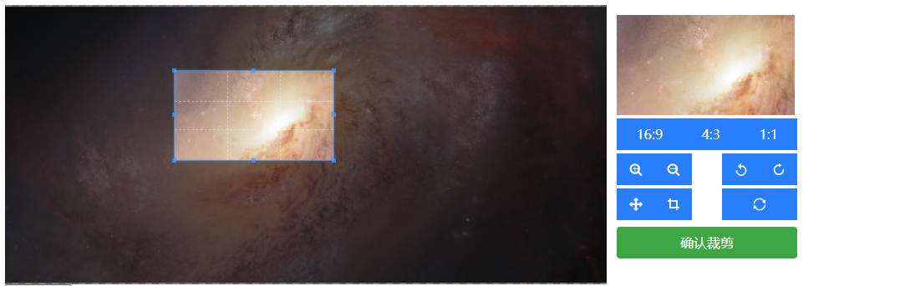

# vue-copperjs-ex



## Usage

### Install

```bash
npm install vue-copperjs-ex --save
```

### ES6
```javascript
import MCopper from "vue-cropperjs-ex";
export default {
  data() {
    return {
      src: "./image.png",
      imgsrc: "",
    };
  },
  mounted() {
    const $this = this;
    this.$refs.file.addEventListener(
      "change",
      function () {
        $this.readFile(this.files[0]).then((rs) => {
          $this.src = rs;
        });
      },
      false
    );
  },
  methods: {
    confirm(url) {
      //this is the image after copper
      this.imgsrc = url;
    },
    readFile(fileObj) {
      return new Promise((resolve, reject) => {
        const reader = new FileReader();
        if (fileObj) {
          reader.readAsDataURL(fileObj);
        }
        reader.addEventListener("load", (_) => resolve(reader.result), false);
      });
    },
  },
  components: {
    MCopper,
  },
};
```

### Props
| Property | Description |
|:--|:--|
| src | the path of the image ,might be a repative path or an image from CDN |
| confirm | trigger when the click the confirm button |

## Contribution
First, install dependencies
```
npm install
```
Second, setup development environment
```
npm run demo
```

## License

[MIT](http://opensource.org/licenses/MIT)